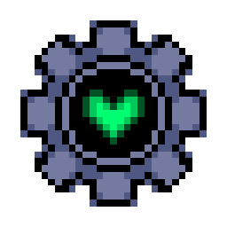

<h1 align="center">Deltamod</h1>

<b>A Deltarune mod manager, written in Node.js and Electron.</b> 

 

 

# Running Deltamod from source
- Download Node.js [here](https://nodejs.org/en).
- Download the latest G3MTool release.
- Create a `tools` folder and add `G3MTool-win32.exe` or `G3MTool-linux` to it, depending on your system.
- Run `npm i`.
- Now you can open your preferred command prompt and run `npm test` to run Deltamod.

 

# Building
Run `npm run build-windows` or `npm run build-linux` to package Deltamod as an installer and as unpacked files.

## OS support
|               | Windows       | Native Linux  | Native macOS | _macOS/Linux_ (w/ CrossOver or Wine) | _All OSes_ (w/ Windows emulation) |
| ------------- |:-------------:|:-----:|:--------:|:--------------:|:-----------------:|
| Officially released | ✅ | ✅ | ❌ | ❌ | ✅ |
| Tested by devs | ✅ | ⚠️ Only one dev | ❌ | ❌ | ⚠️ Should work |
| Devs provide support | ✅ | ✅ | ❌ | ❌ | ✅ _(Specify if you are using emulation when reporting issues)_ |
| Usable | ✅ | ⚠️ Requires Wine | ❌ | ✅ | ✅ |
| Can _theoretically_ be exported to platform | ✅ | ✅ | ✅ |  ✅ | ✅ |
| DELTARUNE supports | ✅ | ⚠️ Supported using Wine | ✅ | ✅ | ✅ |
| Autoupdating | ✅ | ❌ | ❌ | ✅ | ✅ |

## Licensing
The software is licensed under the EUPL 1.2. You can read the license [here](./LICENSE.txt).  
All rights are reserved on the Deltamod name and app icon, though. You may not advertise forks of the program using them - their use is subject to proper authorization, and may be revoked at any time by DELTAModders.  
Additionally, some code related to Itch.io login (which depends on our own servers) is All Rights Reserved and may not be used in forks or unofficial builds.  
Some assets in Deltamod are property of Toby Fox - if you're the copyright owner of these and would like to remove them from the program, feel free to email [ghinorhino@deltamodders.com](mailto:ghinorhino@deltamodders.com).
